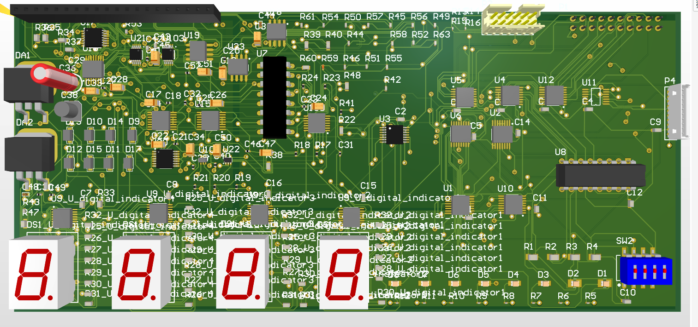
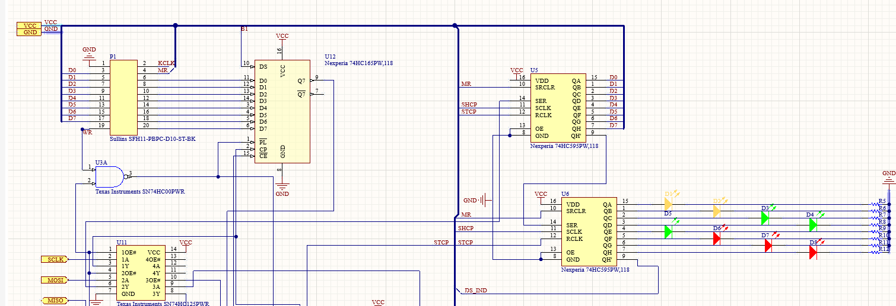
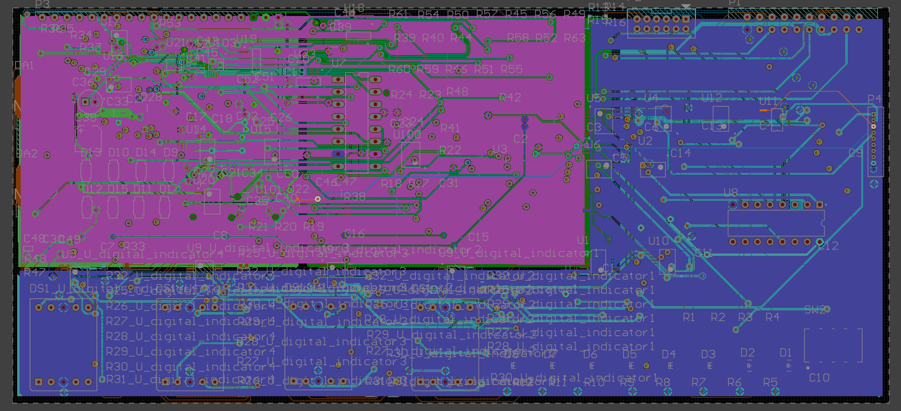
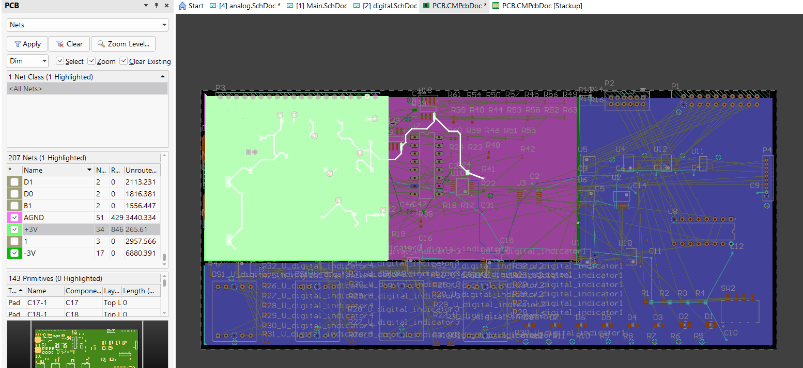
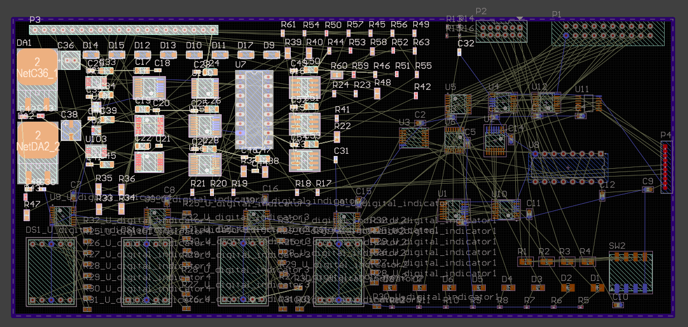
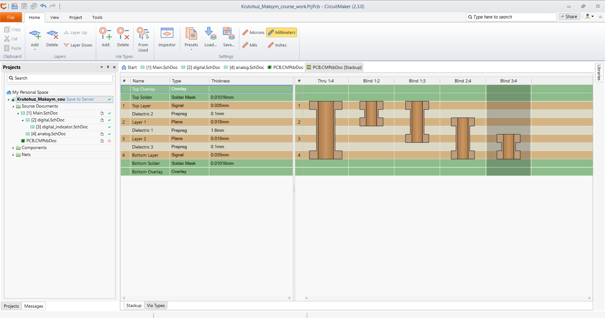
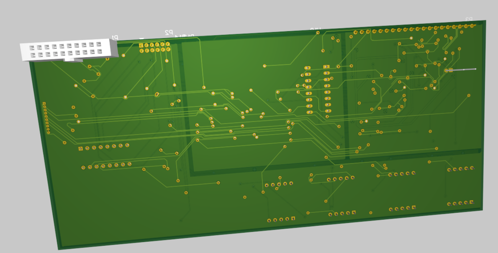

# 4-Layer SPI-Based Multi-Function PCB Design (Training Project)



[Project Schematic (PDF)](./docs/Schematic%20PDF_[No%20Variations].pdf)

### Overview
This project presents the design of a **4-layer printed circuit board (PCB)** developed as a training platform for learning modern hardware design practices.

The board is designed to interface with an external SPI master device (conceptually) and integrates multiple digital and analog subsystems. The primary goal of this project is not a single application, but rather gaining hands-on experience in full-cycle PCB development.

---

### Features
- SPI-based communication interface (conceptual master-slave setup)
- LED and 7-segment display control
- Matrix keyboard input handling
- Shift registers integration
- Analog signal processing using operational amplifiers
- ADC (Analog-to-Digital Converter)
- DAC (Digital-to-Analog Converter)

---

### Hardware Architecture
The design combines both **digital logic (74HC series)** and **analog components**, including:
- Counters, shift registers, multiplexers
- Operational amplifiers (MCP600x series)
- ADC (ADS8867)
- DAC (TLV5604)

The system is modular and demonstrates interaction between multiple subsystems via SPI.



---

### PCB Design
- **4-layer PCB stackup**
    - Top Layer — signal routing
    - Inner Layer 1 — power plane (5V / 3.3V)
    - Inner Layer 2 — ground plane
    - Bottom Layer — signal routing
- Separation of **analog and digital domains**
- Star grounding technique (single-point ground connection)
- Power polygons for multiple voltage domains
- Priority-based manual routing for critical signals
- Basic impedance awareness and EMI reduction techniques






---

### Tools Used
- Altium CircuitMaker
- Simulation: Micro-Cap
- Component sourcing: Digi-Key, Mouser

---

### Project Outputs
- [Schematic design](./docs/Schematic%20PDF_[No%20Variations].pdf)
- PCB layout (4 layers)
- 3D model of the board
- Gerber files for manufacturing

---

### Repository structure

```bash
.
├── LICENSE
├── README.md
├── docs
│   ├── Assembly Drawings_[No Variations].pdf
│   ├── BOM_[No Variations].csv
│   ├── Schematic PDF_[No Variations].pdf
│   └── Крутогуз КВ-22.pdf
├── img
│   ├── 3d_pcb.png
│   ├── PCB1.png
│   ⋮
│   └── PCB6.png
└── src
    ├── Gerber for PCB.CMPcbDoc
    │   ├── NC Drill
    │   │   ├── PCB.CMPcbDoc.DRR
    │   │   ⋮
    │   │   └── PCB.CMPcbDoc.TXT
    │   ├── PCB.CMPcbDoc-macro.APR_LIB
    │   ⋮
    │   ├── PCB.CMPcbDoc_Profile.gbr
    │   └── Status Report.Txt
    ├── step1.cir
    ⋮
    └── step7.cir

```

---

### Learning Outcomes
- Full-cycle PCB design workflow
- Signal routing strategies (manual vs auto)
- Power distribution and grounding techniques
- Integration of analog and digital circuits
- Practical experience with SPI-based system design

---

### Notes
This is a **training project** and was not physically manufactured. The design simulates a real-world hardware system and focuses on engineering practices rather than a specific end-product.

---

**Watch the project videos on YouTube:**
🇺🇦 [Ukrainian version](https://www.youtube.com/watch?v=V8oYccrw_HA&t=2s)

---

### Final results


